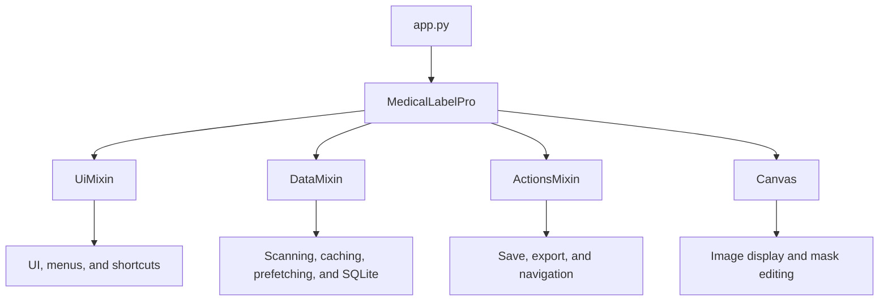
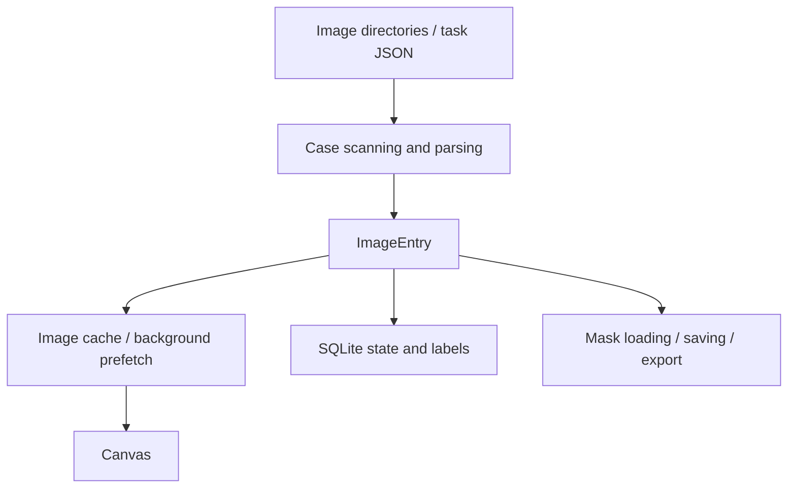

# PTX Annotation

A desktop tool for annotating, reviewing, and managing pneumothorax masks in chest X-ray and CT datasets. Built with PySide6, it supports DICOM, PNG, and NIfTI workflows.

## Features

- CT sequence and single X-ray modes
- DICOM loading, window width/level display, and quick preview
- PNG / NIfTI mask loading, editing, saving, and export
- Brush, eraser, polygon, undo, and redo
- Case search, task JSON, completion status, and label management
- Image caching, sequence prefetching, and cross-case prefetching
- PA-view filtering, mask auditing, and label cleanup tools
- SQLite metadata persistence

## Installation

Python 3.10 or 3.11 is recommended.

```bash
python -m venv .venv
```

Windows:

```bash
.venv\Scripts\activate
pip install -r requirements.txt
```

macOS / Linux:

```bash
source .venv/bin/activate
pip install -r requirements.txt
```

## Launch

```bash
python app.py
```

You can also pass an image file directly for a quick preview:

```bash
python app.py path/to/image.dcm
```

## Basic Usage

1. Select `CT SEQUENCE` or `X-RAY SINGLE` in the toolbar.
2. Use **File → Load** to select the source image directory and, if needed, a mask directory.
3. After scanning cases, open the desired case from the list on the left.
4. Edit masks with the brush, eraser, or polygon tool.
5. Press `Ctrl+S` to save. With autosave enabled, changes are saved when switching cases.
6. Press `T / F` to mark the current case as pneumothorax-positive / negative.

Common keyboard shortcuts:

| Shortcut | Action |
| --- | --- |
| `1 / 2 / 3` | Brush / eraser / polygon |
| `A / D` | Previous / next image |
| `W / S` | Previous / next case |
| `Ctrl+S` | Save mask |
| `Ctrl+Z / Ctrl+Y` | Undo / redo |
| `Ctrl+F` | Search cases |
| `T / F` | Positive / negative label |

## Repository Structure

```text
PTX-Annotation/
├── app.py                  # Application entry point
├── app_config.py           # App name, version, and performance defaults
├── main_window.py          # Main window and shared runtime state
├── ui_mixin.py             # UI, menus, shortcuts, and case search
├── actions_mixin.py        # Save, export, navigation, and interactions
├── data_mixin.py           # Scanning, loading, caching, prefetching, and SQLite
├── canvas.py               # Image and mask rendering canvas
├── widgets.py              # Dialogs and composite widgets
├── models.py               # Core data models and enumerations
├── constants.py            # File formats, extensions, and path rules
├── utils.py                # Shared DICOM / OpenCV / NIfTI I/O
├── icons.py                # UI icon generation
├── tools/                  # Standalone workflow tools
│   ├── case_search.py
│   ├── mask_audit.py
│   └── pa_filter.py
├── tests/                  # Automated tests
├── docs/                   # Design and troubleshooting documentation
├── assets/                 # Application assets
├── scripts/                # Build and maintenance scripts
├── requirements.txt
└── requirements-dev.txt
```

## Application Architecture



Data flow:



The current structure composes existing functionality through mixins. As the project grows, scanning, caching, prefetching, and metadata storage should gradually move into independent services to keep individual mixin files manageable.

## Testing

Install development dependencies:

```bash
pip install -r requirements-dev.txt
```

Run tests:

```bash
pytest -q
```

## Packaging

Use the repository's shared build script:

```bash
python scripts/build.py
```

The default is an `onedir` build, written to:

```text
dist/PTX-Annotation/
```

For a single-file build:

```bash
python scripts/build.py --onefile
```

You can also invoke PyInstaller directly:

```bash
pyinstaller --noconfirm --clean --windowed --onedir \
  --name PTX-Annotation \
  --icon assets/icon.ico \
  app.py
```

For desktop applications with dependencies such as PySide6, SimpleITK, and OpenCV, `onedir` is recommended because missing shared libraries or plugins are easier to diagnose.

## Data and Privacy

This repository is intended for application code and de-identified test logic. Do not commit real medical images, patient information, task databases, or local annotation outputs.

`.gitignore` excludes common DICOM / NIfTI data, SQLite runtime state, caches, and build outputs. Manually inspect staged files before committing to a public repository.
